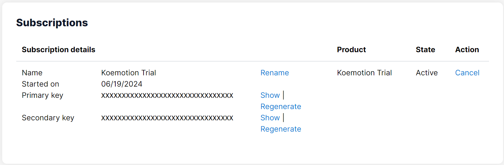

# Koemotionの登録・APIキーの取得方法
1. [rinna developers](https://developers.rinna.co.jp/ja-jp/signin) にアクセスし、**Sign In with Rinna ID**をクリックします。

2. 既にrinna developersを利用したことがある場合、**Sign in name**と**Password**を入力してサインインします。初めて利用する場合、**今すぐサインアップ**からアカウント登録を行うか、**ソーシャルアカウント連携でサインイン**します。

3. **Our AI Models**をクリックします。

4. 登録したいプランをクリックします。プランの詳細については[こちら](https://koemotion.rinna.co.jp/?section=pricing)をご確認ください。

5. 画面をスクロールして**Buy now** (Koemotion Trialの場合は**Try out Free**) をクリックします。遷移先のページでクレジットカードの情報を入力し、登録を行います。

6. 登録が完了すると、画面右上の**Profile**ページからAPIキーを確認できるようになります。画像のPrimary keyまたはSecondary keyのいずれもAPIキーとして利用でき、**Show**をクリックすると確認できます。

